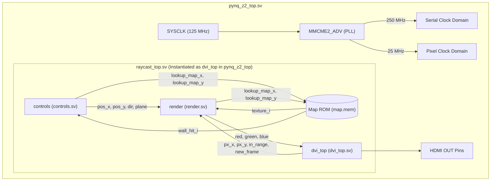

# Architecture Overview

## Design Purpose
The `hardware-raycaster-pynq` design is an FPGA-based hardware raycaster. It implements a 3D graphics rendering engine that generates a first-person perspective of a 2D map using the raycasting algorithm (similar to early 3D games like Wolfenstein 3D). The hardware calculates ray intersections with map walls using Digital Differential Analysis (DDA), scales the wall heights based on distance to simulate 3D perspective, maps textures onto the visible walls, and outputs a continuous DVI/HDMI video stream to a display. It processes keyboard/button inputs to move a virtual camera in the 2D plane and compute updated viewing angles and vectors.

## Top-Level Block Diagram

### Mermaid

*Note: In the current `pynq_z2_top.sv` implementation, `raycast_top` is completely bypassed. `dvi_top` is instantiated directly and fed a hardcoded color bar test pattern (`red_test`, `green_test`, `blue_test`). The actual `raycast_top` encapsulates `controls`, `render`, and `dvi_top`, but it remains uninstantiated at the board level.*

### ASCII Diagram
```text
 +-------------------------------------------------------------------------+
 | pynq_z2_top.sv                                                          |
 |                                                                         |
 |  [SYSCLK 125 MHz] --> [ MMCME2_ADV (Clock Gen) ]                        |
 |                           |              |                              |
 |                           v (250 MHz)    v (25 MHz)                     |
 |                                                                         |
 |  +--- raycast_top.sv -------------------------------------------------+ |
 |  |                                                                    | |
 |  |    [ User Inputs (btns) ]                                          | |
 |  |              |                                                     | |
 |  |              v                                                     | |
 |  |        +----------+                +----------+                    | |
 |  |        | controls |--------------->|  render  |                    | |
 |  |        +----------+ (pos, dir)     +----------+                    | |
 |  |             |                            |                         | |
 |  |             |                            | (rgb pixels)            | |
 |  |             v                            v                         | |
 |  |       (Map ROM)                   +----------+                     | |
 |  |                                   | dvi_top  | ---> [ HDMI Out ]   | |
 |  |                                   +----------+                     | |
 |  +--------------------------------------------------------------------+ |
 +-------------------------------------------------------------------------+
```

## Top-Level Functional Blocks

**pynq_z2_top (`rtl/pynq_z2_top.sv`)**
This is the physical board wrapper for the PYNQ-Z2. It receives the 125 MHz Ethernet PHY clock and uses a Xilinx `MMCME2_ADV` primitive to synthesize a 25 MHz pixel clock and a 250 MHz serial clock. It drives the external HDMI differential pairs (using `OBUFDS` primitives implicitly instantiated inside its child modules) and actively asserts the HDMI Hot Plug Detect (HPD) pin to ensure the sink monitor wakes up. Currently, it generates a hardcoded RGB color bar test pattern and directly instantiates `dvi_top` rather than the raycaster core.

**raycast_top (`rtl/raycast_top.sv`)**
The intended top-level module of the raycaster application. It binds together the three main subsystems: the player control logic (`controls`), the rendering pipeline (`render`), and the video output pipeline (`dvi_top`). It also instantiates the primary 2D map memory (`map.mem`), handling time-multiplexed read access from both the `render` block (during active pixel generation) and the `controls` block (during the vertical blanking interval to check for wall collisions).

**controls (`rtl/controls.sv`)**
Processes user inputs (forward, backward, left, right, rotate) to update the camera's X/Y position, direction vector, and camera plane vector. It splits movement and rotation into two distinct submodules (`position` and `rotation`) and interacts with the map ROM to prevent the player from walking through walls. It operates primarily during the frame vertical blanking period to prevent tearing.

**render (`rtl/render.sv`)**
The core raycasting engine. It takes the current pixel coordinates (provided by `dvi_top`) and the camera parameters (provided by `controls`), projects a ray into the 2D map, steps through the map grid using Digital Differential Analysis (`dda.sv`), and calculates the distance to the nearest wall. It then uses this distance to determine the height of the wall slice to draw on the screen, looks up the corresponding pixel in a texture ROM (`textures.mem`), applies pseudo-lighting based on the hit side (X or Y), and outputs the final RGB color.

**dvi_top (`rtl/dvi/dvi_top.sv`)**
The video output pipeline. It generates the VGA-style horizontal and vertical sync timings (using `dvi_sync`), delays these synchronization signals to match the pipeline latency of the rendering engine and TMDS encoders, encodes the 8-bit RGB color channels into 10-bit TMDS symbols (`tmds_encoder`), serializes them at 10x the pixel clock speed (`serializer`), and converts them into TMDS differential pairs using Xilinx `OBUFDS` primitives (`ds_buf`).