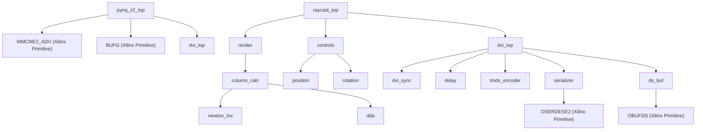

# Module Dependency Graph

## Graph

## Module Table

| Module | File | Purpose | Key Inputs | Key Outputs | Submodules Instantiated |
| :--- | :--- | :--- | :--- | :--- | :--- |
| **pynq_z2_top** | `rtl/pynq_z2_top.sv` | PYNQ-Z2 board wrapper and clock synthesis. | `sysclk`, `btn_i`, `sw_i` | `hdmi_out_data_p/n`, `hdmi_out_clk_p/n`, `hdmi_out_hpd` | `MMCME2_ADV`, `BUFG`, `dvi_top` |
| **pynq_test_pattern_top** | `rtl/pynq_test_pattern_top.sv` | Alternative board wrapper (reference). | `clk`, `btns`, `sws` | TMDS out | `MMCME2_BASE`, `BUFG`, `dvi_top` |
| **raycast_top** | `rtl/raycast_top.sv` | Binds renderer, controls, and video output. | `serial_clk`, `px_clk`, keys | TMDS out | `render`, `controls`, `dvi_top` |
| **render** | `rtl/render.sv` | Raycasting engine and texture mapping pipeline. | `px_x_i`, `px_y_i`, camera pos/dir | `red_o`, `green_o`, `blue_o`, `lookup_map_x/y` | `column_calc` |
| **column_calc** | `rtl/column_calc.sv` | Calculates ray wall hits and texture properties. | screen x, camera pos/dir | `tex_x`, `tex_step`, `tex_height`, map lookup | `newton_inv`, `dda` |
| **newton_inv** | `rtl/newton_inv.sv` | Fixed-point reciprocal via Newton's method. | `num_i`, `start_i` | `num_o`, `done_o` | None |
| **dda** | `rtl/dda.sv` | Steps through 2D map grid to find wall intersections. | `init_map_x/y`, `delta_dist_x/y` | `map_x/y`, `side_dist_x/y`, `done_o` | None |
| **controls** | `rtl/controls.sv` | Handles user input to update camera matrices. | key states, `wall_hit_i` | camera pos, dir, plane | `position`, `rotation` |
| **position** | `rtl/position.sv` | Updates X/Y camera coordinates with collision check. | movement keys, `wall_hit_i` | `pos_x_o`, `pos_y_o` | None |
| **rotation** | `rtl/rotation.sv` | Applies rotation matrix to camera direction/plane. | rotation keys, `update_start_i` | `dir_x_o`, `dir_y_o`, plane | None |
| **dvi_top** | `rtl/dvi/dvi_top.sv` | End-to-end video sync, encoding, and serialization. | `serial_clk`, `pixel_clk`, RGB | TMDS pins, `x_o`, `y_o` | `dvi_sync`, `delay`, `tmds_encoder`, `serializer`, `ds_buf` |
| **dvi_sync** | `rtl/dvi/dvi_sync.sv` | Generates VGA timing parameters and pixel counters. | `clk_i` | `hsync_o`, `vsync_o`, `pixel_x_o`, `pixel_y_o` | None |
| **delay** | `rtl/dvi/delay.sv` | Configurable delay line for synchronization. | `clk`, `data_i` | `data_o` | None |
| **tmds_encoder** | `rtl/dvi/tmds_encoder.sv` | Encodes 8-bit color into 10-bit TMDS symbols. | `D`, `C0`, `C1`, `DE` | `q_out` | None |
| **serializer** | `rtl/dvi/serializer.sv` | 10:1 DDR serialization using Xilinx OSERDESE2. | `clk` (serial), `pixel_clk`, `data_i` | `data_o` | `OSERDESE2` |
| **ds_buf** | `rtl/dvi/ds_buf.sv` | Differential signaling output buffer wrapper. | `in` | `out`, `out_n` | `OBUFDS` |
