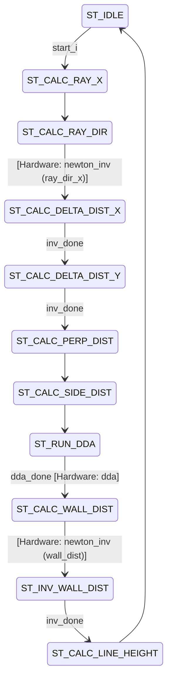
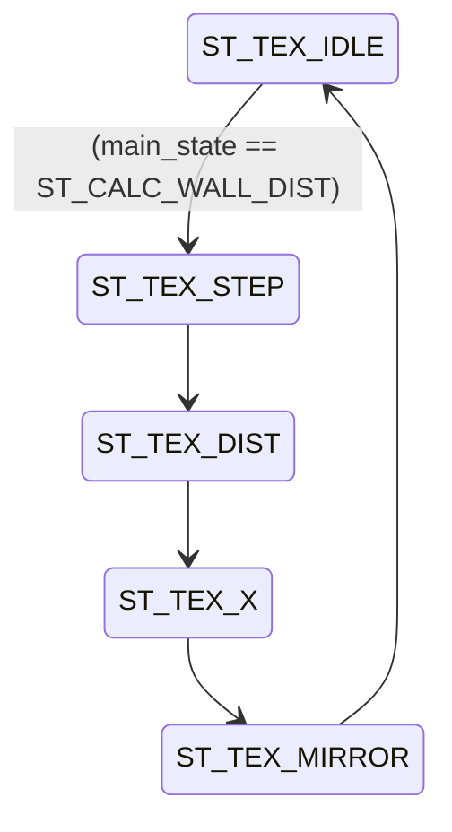
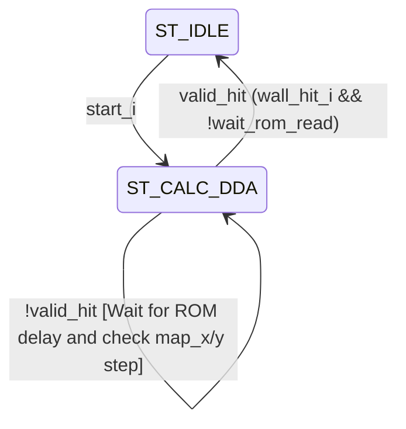
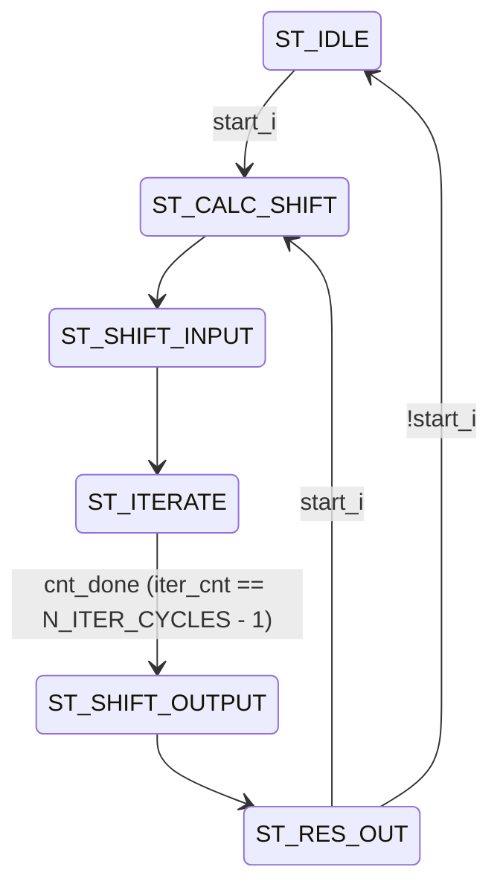
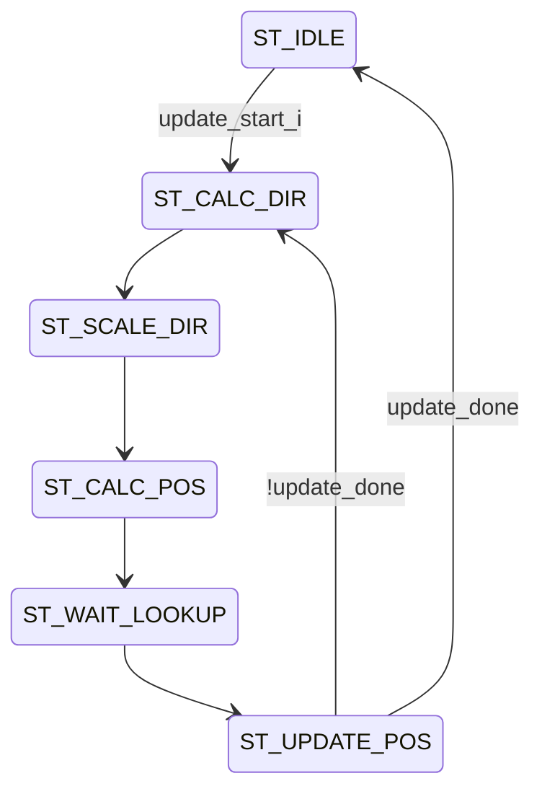
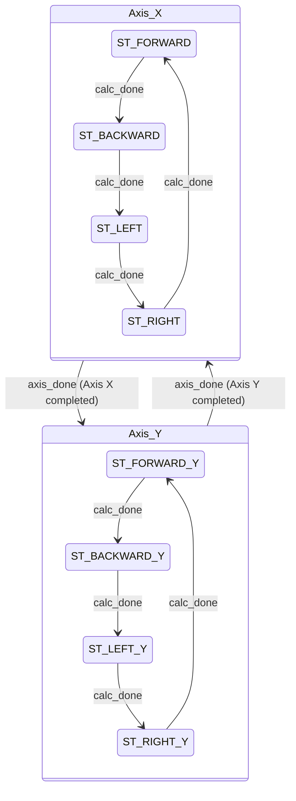
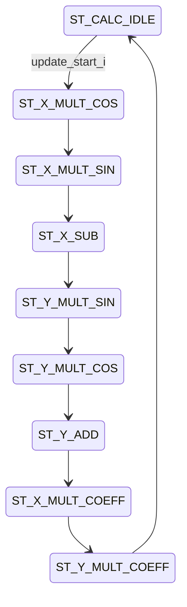

# Control State Machines

## `column_calc.sv` - Main FSM (`main_state`)

## `column_calc.sv` - Texture FSM (`tex_state`)

## `dda.sv` - DDA FSM (`state`)

## `newton_inv.sv` - Newton's Method FSM (`state`)

## `position.sv` - Calculate State (`calc_state`)

## `position.sv` - Control & Axis State (`cntrl_state` & `axis_state`)
*Note: These act as nested iterators controlling `calc_state`. First it tests X axis forward, backward, left, right; then Y axis forward, backward, left, right.*

## `rotation.sv` - Calculate State (`calc_state`)

